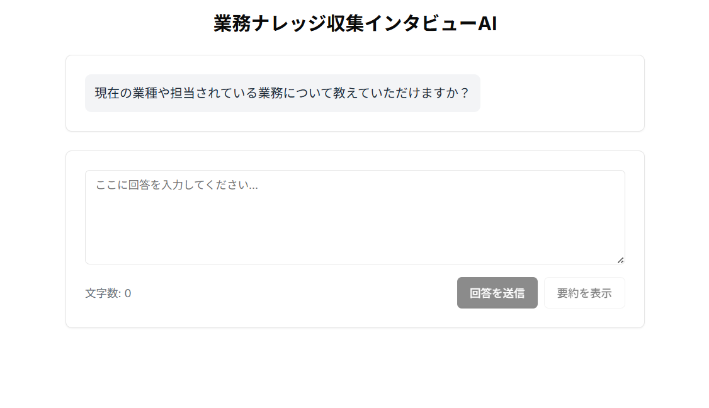

# 業務ナレッジ収集インタビューAI

## デモ



*デモ画面: インタビューAIとの対話例*

## 概要

このプロジェクトは、業務ナレッジの属人化を防ぐための「インタビューAI」Webアプリです。  
AIがユーザーに業務経験や判断基準、工夫などを自然な会話形式で質問し、回答内容を要約・整理します。  
業務の引き継ぎやナレッジ共有、後任育成などに活用できます。

## 主な機能

- AIによる業務ナレッジ収集インタビュー
- 回答内容の自動要約・整理
- 会話履歴の表示
- 文字数や経過時間に応じた通知

## 技術スタック

- Next.js
- React
- TypeScript
- Tailwind CSS
- Radix UI
- OpenAI API など

## 動作要件

- Node.js 18.0.0以上
- pnpm または npm

## セットアップ方法

1. リポジトリをクローン
    ```bash
    git clone <このリポジトリのURL>
    cd <リポジトリ名>
    ```

2. 依存パッケージのインストール
    ```bash
    pnpm install
    # または
    npm install
    ```

3. 環境変数の設定  
   `.env.sample` をコピーして `.env.local` を作成し、必要なAPIキー等を設定してください。
    ```bash
    cp .env.sample .env.local
    ```
     **OpenAI APIキーの取得方法**
   1. [OpenAI公式サイト](https://platform.openai.com/) にアクセスし、アカウントを作成またはログインします。
   2. ユーザーアイコンから「API Keys」ページに移動します。
   3. 「Create new secret key」ボタンを押してAPIキーを発行します。
   4. 発行されたAPIキーを `.env.local` の該当箇所（例: `OPENAI_API_KEY=...`）に貼り付けてください。

   > ⚠️ APIキーは公開しないように注意してください。
    

4. MITライセンスファイルの追加（必要に応じて）
    ```bash
    curl -o LICENSE https://raw.githubusercontent.com/licenses/license-templates/master/templates/mit.txt
    ```

5. 開発サーバーの起動
    ```bash
    pnpm dev
    # または
    npm run dev
    ```

6. ブラウザで `http://localhost:3000` にアクセス

## 環境変数の設定

`.env.local` に以下の環境変数を設定してください：

```env
# OpenAI API設定
OPENAI_API_KEY=your_api_key_here
OPENAI_MODEL=gpt-4-turbo-preview  # または gpt-3.5-turbo など

# その他の設定（必要に応じて）
NEXT_PUBLIC_APP_URL=http://localhost:3000
```

## ライセンス

このプロジェクトは [MITライセンス](./LICENSE) のもと、**商用利用を含めて自由にご利用いただけます**。

## 貢献

バグ報告・機能提案・プルリクエスト歓迎します。

## 免責事項

- 本ソフトウェアの利用によるいかなる損害も、作者は責任を負いません。
- OpenAI等の外部API利用時は、各サービスの利用規約をご確認ください。

---

> © 2024 業務ナレッジ収集インタビューAI